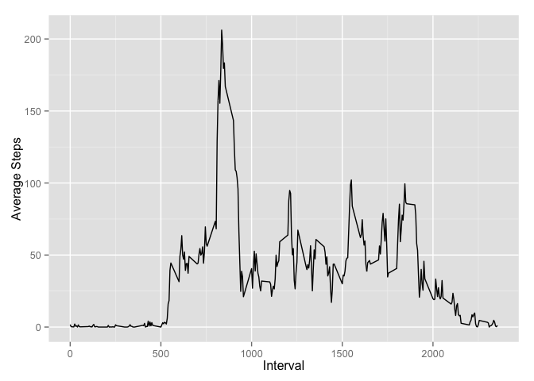

# Reproducible Research: Peer Assessment 1


## Loading and preprocessing the data
In this project we are bringing in a dataset of activity data from a fitness monitoring device. The data includes the number of steps taken in each five minute interval of the day.

```r
#load Required Libraries 
library(plyr)
library(ggplot2)
library(timeDate)
# Download, unzip and cleanup
zip <- 'activity.zip'
url = 'https://d396qusza40orc.cloudfront.net/repdata%2Fdata%2Factivity.zip'
download.file(url, zip, method='curl')
unzip(zip)
file.remove(zip)
```

```
## [1] TRUE
```

```r
rm(list=ls())
# Read in the data and summarise by day
activity <- read.csv("activity.csv")
```

## What is mean total number of steps taken per day?
Now we want to explore the data a little more.  Lets look at a histogram, the mean, and the median of steps per day.

```r
daily_activity <- ddply(activity, "date", summarize, daily.steps = sum(steps))
qplot(daily.steps, data=daily_activity, geom="histogram", binwidth=1000)
```

 

```r
# Average number of steps per day
mean(daily_activity$daily.steps, na.rm=TRUE)
```

```
## [1] 10766.19
```

```r
# Median number of steps per day
median(daily_activity$daily.steps, na.rm=TRUE)
```

```
## [1] 10765
```

## What is the average daily activity pattern?
Lets take a look at what an average day looks like. Here is a time series of the average number of steps taken in each 5 minute interval throughout the day.


```r
# Calculate average number of steps per interval over all days.
average.day <- ddply(activity, "interval", summarize, steps = mean(steps, na.rm=TRUE))
ggplot(average.day, aes(interval,steps)) + geom_line() + xlab("Interval") +ylab("Average Steps")
```

 

```r
# Which interval has the highest number of steps?
average.day[which.max(average.day$steps),'interval']
```

```
## [1] 835
```

## Imputing missing values
There are a few days when the activity monitor data reported NA probably from the device not being worn. Lets figure out how many intervals reported NA. Then lets try to remove some of the bias of not having data on those days by filling in the NAs with the average daily interval value for that NA. With the new data we will look at the new average steps per day and the median steps per day.

```r
# Total number of intervals with missing values
sum(is.na(activity$steps))
```

```
## [1] 2304
```

```r
# Replace missing values with the average for that time interval
impute.mean <- function(x) replace(x, is.na(x), mean(x, na.rm = TRUE))
activity2 <- ddply(activity, "interval", transform, steps = impute.mean(steps))
# Summarize new data with the NA values replaced
daily_activity2 <- ddply(activity2, "date", summarize, daily.steps = sum(steps))
qplot(daily.steps, data=daily_activity2, geom="histogram", binwidth=1000)
```

 

```r
# Average of the new data
mean(daily_activity2$daily.steps, na.rm=TRUE)
```

```
## [1] 10766.19
```

```r
# Median of the new data
median(daily_activity2$daily.steps, na.rm=TRUE)
```

```
## [1] 10766.19
```

## Are there differences in activity patterns between weekdays and weekends?
Lets now compare the activity between weekdays and the weekend.


```r
# Is this a weekday or not?
activity2$weekday <- factor(isWeekday(activity2$date,wday=1:5),
                            labels=c('Weekend', 'Weekday'))
average.weekday <- ddply(activity2, c("interval","weekday"), summarize, steps = mean(steps))
# Average steps: Weekday vs Weekend
aggregate(steps~weekday, data=average.weekday, FUN='sum')
```

```
##   weekday    steps
## 1 Weekend 12201.52
## 2 Weekday 10255.85
```

```r
ggplot(average.weekday, aes(interval,steps)) + geom_line(color="blue") + xlab("Interval") +ylab("Average Steps") + facet_wrap(~weekday, nrow=2)
```

 
